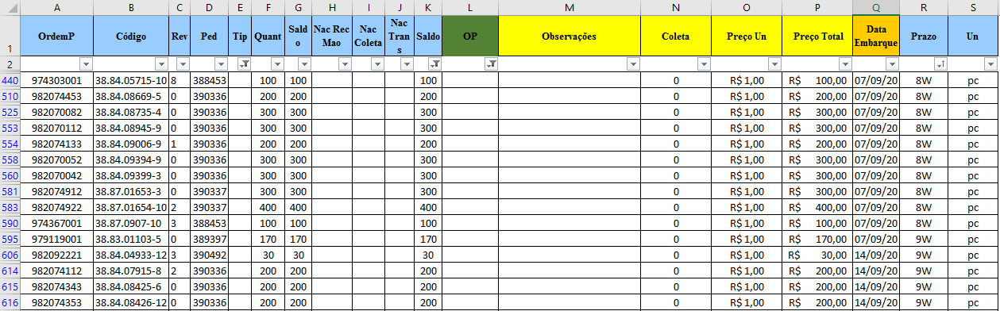

 O projeto a seguir apresenta um aplicativo escrito na linguagem de programação Python3, que automatiza o processo de criação de ordens de produção conforme uma padronização dos documentos.
 
 Este projeto utiliza as ferramentas: VSCode, GitHub, MS Excel e Python3 (Pandas, openpyxl, FreeSimpleGUI).
 O código fonte e as planilhas utilizadas se encontram nos arquivos do repositório.
 
 Considere a situação: Uma empresa fictícia envia todas as semanas uma nova carteira de pedidos de compra, sempre organizada no mesmo padrão. A empresa fornecedora é uma fábrica de peças de chapa metálica, que deseja criar um script que automatize o processo de criação das ordens de produção para os pedidos da carteira, para isso, ela utiliza um modelo de ordem de produção, e cria um programa em Python para manipular estes dados.
 
 O funcionamento do programa é mostrado no gif a seguir:
 
 (Clique na imagem abaixo para reproduzir o gif.)
 
 
 
 A imagem a seguir mostra o padrão de carteira de pedidos do cliente:
 
 
 
 A imagem a seguir mostra a carteira de pedidos depois de ser organizada para a geração das ordens de produção:
 
 
 
 A próxima imagem mostra o modelo de Ordem de Produção (OP) desenvolvido pelo fornecedor:
 
 
 
 O script desenvolvido preenche o modelo com os dados fornecidos na carteira, como código, revisão, pedido e prazo. Outros dados como material da peça, insumos necessários, espessura da chapa, dependem do desenho técnico da peça, portanto, serão analisados e preenchidos em outra ocasião.
 
 A imagem a seguir mostra o resultado de uma das ordens de produção criadas.
 
 
 
 O script irá registrar também a criação de cada uma das novas ordens de produção na coluna "OP" da carteira, e por fim gerar uma carteira atualizada.

